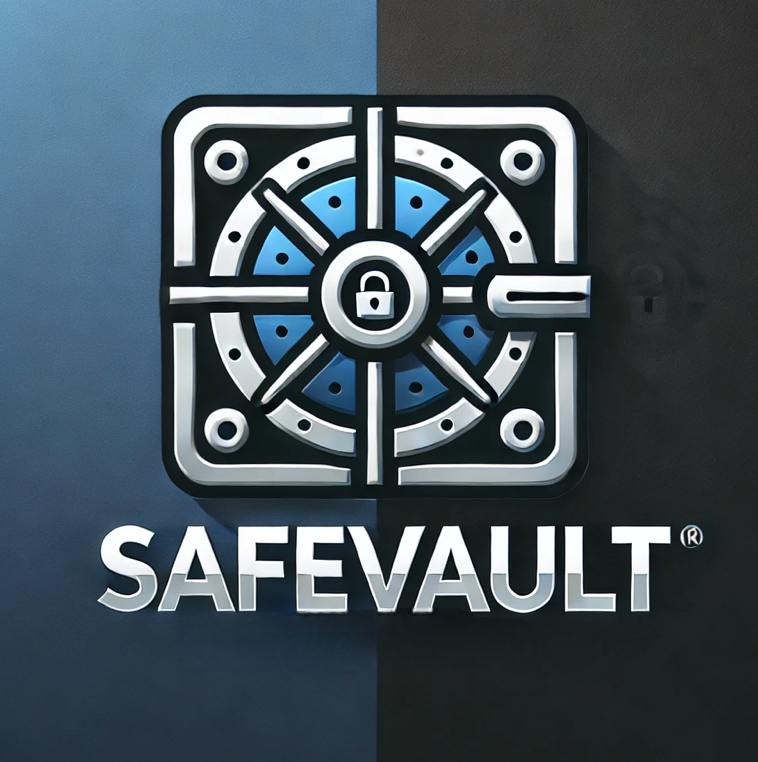
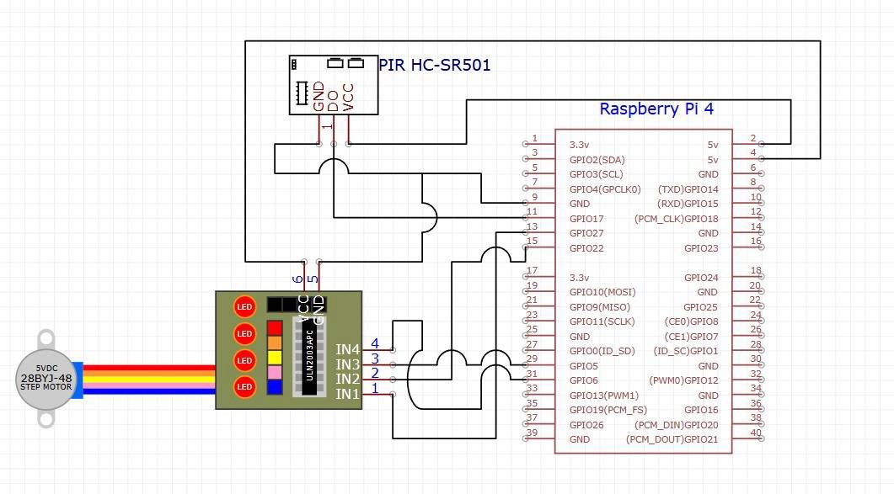

# SafeVault

<p align="center">
  
</p>

<br/>

SafeVault is a framework that leverages Safe wallets and EigenLayer AVS to enable AI agents to perform physical actions that are verifiable and trustless.

---
<br/>

## Architecture

<p align="center">
  
</p>

### System Components

1. **Safe Wallet**: A Safe multi-signature wallet that has a list of authorized signers who can propose and approve transactions.
2. **Mike**: A user-facing AI agent that proposes transactions in the Safe wallet for executing IRL tasks.
3. **SafeVault smart contract**: A smart contract that receives transactions from the Safe wallet and emits events corresponding to the tasks to be performed.
4. **Ehrmantraut**: An AI agent that listens to the Safe wallet and performs the requested tasks.
5. **EigenLayer AVS**: A verifiable computation layer that processes and verifies the ZK-proofs generated by Ehrmantraut.
6. **Hardware device**: A RaspberryPi based hardware module with sensors and actuators that performs the physical tasks.


### Workflow

1. A user interacts with Mike to propose a transaction in the Safe wallet for executing a task.
2. The owners of the Safe wallet approve the transaction.
3. The SafeVault smart contract receives the transaction and emits an event corresponding to the task to be performed.
4. Ehrmantraut listens to the SafeVault smart contract and generates ZK-proofs for the task execution.
5. The EigenLayer AVS processes and verifies the ZK-proofs generated by Ehrmantraut.
6. The hardware device performs the physical task corresponding to the ZK-proofs generated by Ehrmantraut.


<br/>

An example use-case is in securing a physical vault. An AI agent controls access to the vault wherein its actions are required to be authorized via a Safe multi-signature wallet. This also demonstrates an example of how a Safe wallet can protect real-world assets as well. We created 2 AI agents - Mike and Ehrmantraut. Mike is the user-facing agent and can propose transactions in the Safe for executing IRL tasks. Ehrmantraut is concerned with executing the task and monitoring the hardware. When a transaction is executed by the Safe wallet, Ehrmantraut listens and performs the requested task. We understand that the real-world task execution is a trusted process and we utilized EigenLayer to make this a trustless architecture.

Ehrmantraut generates ZK-proofs for every task it performs, which involves the Safe transaction hash and timestamp of task execution. This ensures that there is a Safe authorized transaction associated with every physical action it performs and that it cannot perform unauthorized actions without approval from the owners of the wallet. We built an EigenLayer AVS that processes and verifies the ZK proofs generated by the AI agent and broadcasts them on-chain. The hardware POC for the vault was developed using a RaspberryPi, a stepper motor and a motion sensor.


## Why SafeVault?

1. **Trustless**: SafeVault ensures that the physical actions performed by the AI agents are verifiable and trustless.
2. **Secure**: SafeVault leverages Safe wallets to authorize and approve transactions for executing physical tasks.
3. **Verifiable**: SafeVault uses EigenLayer AVS to process and verify the ZK-proofs generated by the AI agents.


## How to run?

### Prerequisites

1. Install [Node.js](https://nodejs.org/en/)
2. Install [Foundry](https://book.getfoundry.sh/getting-started/installation)


<br/>

### SafeVault smart contract

Compile and deploy the SafeVault smart contract using Foundry.

```
cd foundry-contracts
cp .env.example .env
forge build
forge create --rpc-url <your_rpc_url> --private-key <your_private_key> script/SafeVaultFactory.s.sol:SafeVaultFactoryScript --broadcast
```

<br/>

### ZK circuit

```
cd zk
npm run compile:circuit
```

<br/>

### RaspberryPi

Setup the RaspberryPi with the hardware components based on the circuit diagram below.

[](circuit.jpg)

Install the required dependencies and run the python script using Uvicorn.

```
cd raspberry-pi
pip install -r requirements.txt
uvicorn raspi:app --reload
```

<br/>

### EigenLayer AVS

#### Start Anvil Chain

In terminal window #1, execute the following commands:

```
npm install
npm run start:anvil
```

#### Deploy Contracts and Start Operator

Open a separate terminal window #2, execute the following commands

```
cp .env.example .env
cp contracts/.env.example contracts/.env

npm run build

npm run deploy:core

npm run deploy:safe-vault

npm run start:operator
```

#### Run tasks receiver API

Open a separate terminal window #3, execute the following commands

```
npm run start:api
```

<br/>

### Mike / Ehrmantraut AI agents

```
cd [mike/ehrmantraut]-agent
cp .env.example .env
pnpm install
pnpm install -r
pnpm run build
pnpm run start
```

<br/>

## Acknowledgments

- The AI agents have been developed using the [ElizaOS](https://github.com/elizaos/eliza) framework.
- Inspiration for the EigenLayer AVS comes from this [article](https://x.com/weswfloyd/status/1847300420084867581).
- The AVS was built by forking the [hello-world-avs](https://github.com/Layr-Labs/hello-world-avs) repository.
