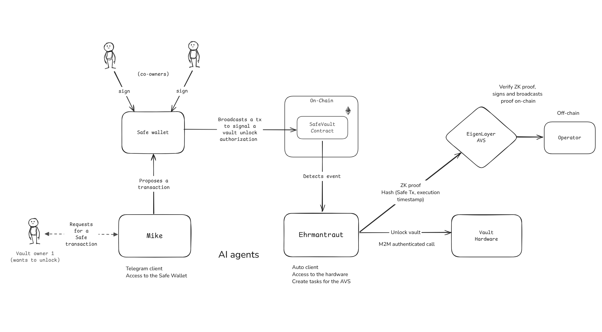

# SafeVault

  

 

SafeVault is a framework that leverages Safe wallets and EigenLayer AVS to enable AI agents to perform physical actions that are verifiable and trustless.

 

## Workflow

  

We would like to show a use-case of securing a physical vault. An AI agent controls access to the vault wherein its actions are required to be authorized via a Safe multi-signature wallet. This also demonstrates an example of how a Safe wallet can protect real-world assets as well. We created 2 AI agents - Mike and Ehrmantraut. Mike is the user-facing agent and can propose transactions in the Safe for executing IRL tasks. Ehrmantraut is concerned with executing the task and monitoring the hardware. When a transaction is executed by the Safe wallet, Ehrmantraut listens and performs the requested task. We understand that the real-world task execution is a trusted process and we utilized EigenLayer to make this a trustless architecture.

Ehrmantraut generates ZK-proofs for every task it performs, which involves the Safe transaction hash and timestamp of task execution. This ensures that there is a Safe authorized transaction associated with every physical action it performs and that it cannot perform unauthorized actions without approval from the owners of the wallet. We built an EigenLayer AVS that processes and verifies the ZK proofs generated by the AI agent and broadcasts them on-chain. The hardware POC for the vault was developed using a RaspberryPi, a stepper motor and a motion sensor.

The framework ensures that only authorized individuals can give the green light for the AI agent to perform its task, making it a more secure and trustworthy approach to AI-driven automation, in which human control and transparency are always maintained.
